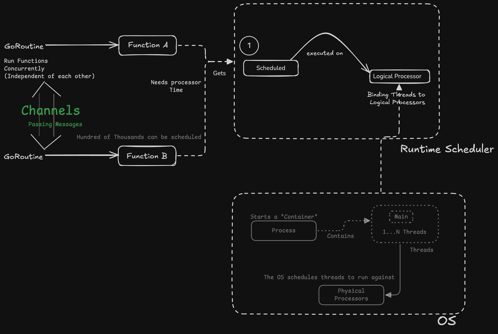
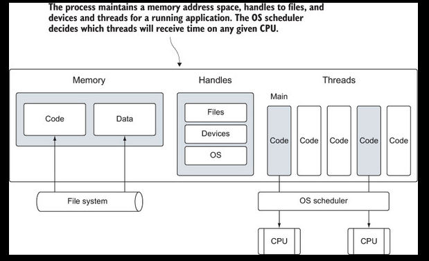
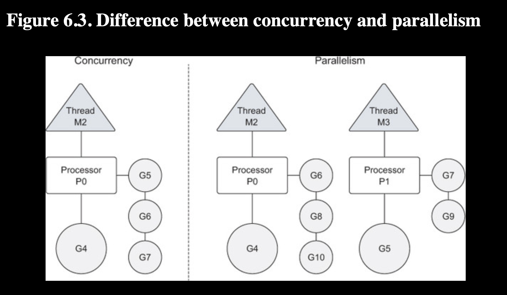
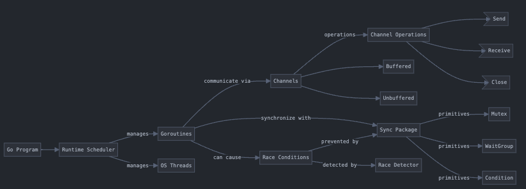

# GENERAL

- “In Go, all variables are passed by value. Since the value of a pointer
         variable is the address to the memory being pointed to, passing pointer variables between functions is still considered a
         pass by value.”


- “The keyword defer is used to schedule a function call to be executed right after a function returns. It’s our responsibility to close the file
         once we’re done with it. By using the keyword defer to schedule the call to the close method, we can guarantee that the method will be called. This will happen even if the function panics and terminates unexpectedly.
         The keyword defer lets us write this statement close to where the opening of the file occurs, which helps with readability and reducing bugs”


- “Remember that in Go, a command is any executable program”

# GO DEPENDENCIES


In Go, dependencies are managed through `modules`, which were introduced in `Go 1.11`. Here's the key aspects:

1. **go.mod file**:
- This is the main file that declares the module path and dependencies
- Created using `go mod init <module-name>`
- Example:
```go
module myproject

go 1.20

require (
    github.com/gorilla/mux v1.8.0
    github.com/lib/pq v1.10.0
)
```

2. **go.sum file**:
- Contains cryptographic hashes of dependencies
- Ensures reproducible builds
- Generated automatically by Go

3. **Adding dependencies**:
- Run `go get package-name` to add a dependency
- Or just import the package in your code and run `go mod tidy`
```go
import "github.com/gorilla/mux"
```

4. **Dependency location**:
- Dependencies are stored in `$GOPATH/pkg/mod`
- Each version of a dependency is stored separately

5. **Version management**:
- Use semantic versioning (v1.2.3)
- Can specify versions in go.mod:
```go
require github.com/example/package v1.2.3
```

6. **Common commands**:
```bash
go mod init    # Initialize new module
go mod tidy    # Add missing and remove unused modules
go get        # Add or update dependencies
go mod verify # Verify dependencies
go mod edit -replace playground/datastructures=../playground/datastructures # To be able to use a package/module in another module
```

Would you like me to elaborate on any of these aspects?

## CLOSURE

A closure is a function that can access and manipulate variables from its outer scope, even after the outer function has finished executing. The closure "closes over" the variables it needs, maintaining their state.

```go
func createCounter() func() int {
    count := 0               // This variable is "captured" by the closure
    return func() int {
        count++              // The inner function can access and modify count
        return count
    }
}

// Usage
counter := createCounter()
fmt.Println(counter())  // 1
fmt.Println(counter())  // 2
```

# CONVENTIONS

1. “You follow a naming convention in Go when naming interfaces. If the interface type contains only one method, the name of the
         interface ends with the er suffix”


# PACKAGES - IMPORT

- “Packages are found on disk based on their relative path to the directories referenced by the Go environment. Packages in the
         standard library are found under where Go is installed on your computer. Packages that are created by you or other Go developers
         live inside the GOPATH, which is your own personal workspace for packages”

  - “The compiler will stop searching once it finds a package that satisfies the import statement. The important thing to remember
         is that the Go installation directory is the first place the compiler looks and then each directory listed in your GOPATH in the order that they’re listed”

- “Packages can be small
      
      
      It’s common in Go to see packages that are relatively small by the standards of other programming languages. Don’t be afraid
         to make a package that has a small API or performs only a single task. That’s normal and expected.”
- “When you’re using go get, you specify the full path to the package that should be imported. This means that when you create a repository that you
         intend to share, the package name should be the repository name, and the package’s source should be in the root of the repository’s
         directory structure”


## REMOTE IMPORTS


      
      
      import "github.com/spf13/viper"
      
      When you try to build a program with this import path, the go build command will search the “ GOPATH for this package location on disk. The fact that it represents a URL to a repository on GitHub is irrelevant as far as the
         go build command is concerned. When an import path contains a URL, the Go tooling can be used to fetch the package from the DVCS and
         place the code inside the GOPATH at the location that matches the URL. This fetching is done using the `go get command`. go get will fetch any specified URL or can be used to fetch the dependencies a package is importing that are go-gettable. Since
         go get is recursive, it can walk down the source tree for a package and fetch all the dependencies it finds.”


# GO TOOLS

- `go vet`. to check compiled errors.
- `go fmt` to format files. 
- `go doc xxx` to check documentation by packages.


# DATA STRUCTURES

## ARRAYS

- “Arrays are valuable data structures because the memory is allocated sequentially”

In memory [0]0x1 [1]0x2 [2]0x3 etc

- “Once an array is declared, neither the type of data being stored nor its length can be changed. If you need more elements,
         you need to create a new array with the length needed and then copy the values from one array to the other.”

- “Passing an array between functions can be an expensive operation in terms of memory and performance. When you pass variables
         between functions, they’re always passed by value. When your variable is an array, this means the entire array, regardless
         of its size, is copied and passed to the function”

- “Passing an array of 1M to the function `foo`. Every time the function foo is called, eight megabytes of memory has to be allocated on the stack. Then the value of the array, all eight megabytes of
         memory, has to be copied into that allocation.”

```go
“there’s a better and more efficient
         way of doing this. You can pass a pointer to the array and only copy eight bytes, instead of eight megabytes of memory on
         the stack.
      
      // Allocate an array of 8 megabytes.
        var array [1e6]int

        // Pass the address of the array to the function foo.
        foo(&array)

        // Function foo accepts a pointer to an array of one million integers.
        func foo(array *[1e6]int) {
            ...
        }
      
      This time the function foo takes a pointer to an array of one million elements of type integer. The function call now passes the address of the array,
         which only requires eight bytes of memory to be allocated on the stack for the pointer variable.”


```

## SLICE - DYNAMIC ARRAY

- “A slice is a data structure that provides a way for you to work with and manage collections of data. Slices are built around the
         concept of dynamic arrays that can grow and shrink as you see fit.”


- “Slices are tiny objects that abstract and manipulate an underlying array. They’re three-field data structures that contain
         the metadata Go needs to manipulate the underlying arrays”

 1. A Pointer to the underlying array.
 2. Length/Number of elements the slice has access to
 3. The capacity/Number of elements the slice has available for growth.


- “One way to create a slice is to use the built-in function `make`. When you use make, one option you have is to specify the length of the slice.
      
      
```go
// Create a slice of strings.
    // Contains a length and capacity of 5 elements.
    slice := make([]string, 5)

    // Create a slice of integers.
    // Contains a length of 3 and has a capacity of 5 elements.
    slice := make([]int, 3, 5)

```  
  
- '“if you specify a value inside the [ ] operator, you’re creating an array. If you don’t specify a value, you’re creating a slice”

- “// Contains a length and capacity of 5 elements.
`slice := []int{10, 20, 30, 40, 50}”`


“// Create a new slice.
// Contains a length of 2 and capacity of 4 elements.
`newSlice := slice[1:3]`”

“or slice[i:j] with an underlying array of capacity k

Length:   j - i
Capacity: k - i
      
      If you apply this formula to newSlice you get the following.
      
      
      
      
      Listing 4.27. Calculating the new length and capacity
      
      For slice[1:3] with an underlying array of capacity 5

Length:   3 - 1 = 2
Capacity: 5 - 1 = 4
      
      Another way to look at this is that the first value represents the starting index position of the element the new slice will
         start with—in this case, 1. The second value represents the starting index position (1) plus the number of elements you want
         to include (2); 1 plus 2 is 3, so the second value is 3. Capacity will be the total number of elements associated with the
         slice”

```
“You need to remember that you now have two slices sharing the same underlying array. Changes made to the shared section of
         the underlying array by one slice can be seen by the other slice.”

Excerpt From
Go in Action
William Kennedy
This material may be protected by copyright.
```

## Growing slices
      
      
      One of the advantages of using a slice over using an array is that you can grow the capacity of your slice as needed. Go takes
         care of all the operational details when you use the built-in function append.”


# MAP

- “Passing a map between two functions doesn’t make a copy of the map”


# GO's Types

- “In the case of many of the built-in types, size and representation are part of the
         type’s name. A value of type int64 requires 8 bytes of memory (64 bits) and represents an integer value. A float32 requires 4 bytes of memory (32 bits) and represents an IEEE-754 binary floating-point number. A bool requires 1 byte of memory (8 bits) and represents a Boolean value of true or false”


## User defined

- “The most common way is to use the keyword struct, which allows you to create a `composite` type”

```go
// Initializes to default
type user struct {
    name    string
    email   string
    ext     int
    priv    bool
}
```

### VAR vs SHORT OPERATOR (:=)

- “Any time a variable is created and initialized to its zero value, it’s idiomatic to use the keyword `var`. Reserve the use of the keyword var as a way to indicate that a variable is being set to its zero value. If the variable will be initialized to something other
         than its zero value, then use the short variable declaration operator `:=` with a struct literal”

```go
“// Declare a variable of type user and initialize all the fields.
 lisa := user{
     name:       "Lisa",
     email:      "lisa@email.com",
     ext:        123,
     privileged: true,
 }”


“// Declare a variable of type user.
lisa := user{"Lisa", "lisa@email.com", 123, true}”


```

- “The short variable declaration operator serves two purposes in one operation: it both declares and initializes a variable.
         Based on the type information on the right side of the operator, the short variable declaration operator can determine the
         type for the variable.”


## Methods

- “There are two types of receivers in Go: `value` receivers and `pointer` receivers”

```go
func (u user) notify() {

}


```

### Value Receiver
- The Built-in types (string, bool) are passed as values. (primitive nature)

- “When you declare a method using a value receiver, the method will always be operating against a copy of the value used to
         make the method call”


```go
     // Values of type user can be used to call methods
     // declared with a value receiver.
     bill := user{"Bill", "bill@email.com"}
     bill.notify()”

```

- “You can also call methods that are declared with a value receiver using a pointer.
      
      
```go
// Pointers of type user can also be used to call methods
     // declared with a value receiver.
     lisa := &user{"Lisa", "lisa@email.com"}
     lisa.notify()”

     “Once again, notify is operating against a copy, but this time a copy of the value that the lisa pointer points to.”

```


### Pointer Recivers

“shows the declaration of the changeEmail method, which is declared with a pointer receiver. This time, the receiver is not a value of type user but a pointer of type user. When you call a method declared with a pointer receiver, the value used to make the call is shared with the method”


```go
// changeEmail implements a method with a pointer receiver.
 func (u *user) changeEmail(email string) {
     u.email = email
 }”
```

## Nature of Type

- The nature of this type is non-primitive. Values of this type are actually unsafe to be copied.

```go
type File struct {
     *file
}

func (f *File) Chdir() error {}

```
- “The decision to use a value or pointer receiver should not be based on whether the method is mutating the receiving value.
         The decision should be based on the nature of the type”


## Interfaces

“Polymorphism is the ability to write code that can take on different behavior through the implementation of types”


## Type Embedding

- “Go allows you to take existing types and both extend and change their behavior. This capability is important for code reuse
         and for changing the behavior of an existing type to suit a new need. This is accomplished through type embedding. It works by taking an existing type and declaring that type within the declaration of a new struct type. The type that is
         embedded is then called an inner type of the new outer type.”

- “Through inner type promotion, identifiers from the inner type are promoted up to the outer type. These promoted identifiers
         become part of the outer type as if they were declared explicitly by the type itself. The outer type is then composed of everything
         the inner type contains, and new fields and methods can be added. The outer type can also declare the same identifiers as
         the inner type and override any fields or methods it needs to. This is how an existing type can be both extended and changed.”


```go

// admin represents an admin user with privileges.
type admin struct {
   user  // Embedded Type
   level string
}

ad := admin{
   user: user{
       name:  "john smith",
       email: "john@yahoo.com",
   },
   level: "super",
}

// We can access the inner type's method directly.
ad.user.notify()

// The inner type's method is promoted.
ad.notify()


// Send the admin user a notification.
// The embedded inner type's implementation of the
// interface is "promoted" to the outer type.
sendNotification(&ad)

// sendNotification accepts values that implement the notifier
// interface and sends notifications.
func sendNotification(n notifier) {
   n.notify()
}

// notifier is an interface that defined notification
// type behavior.
type notifier interface {
   notify()
}

// sendNotification accepts values that implement the notifier
// interface and sends notifications.
func sendNotification(n notifier) {
   n.notify()
}
```

## [Visibility Rules] - Unexported vs Exported Fields

- “Identifiers are either exported or unexported from packages.”

- Unexported fields are private to the package where it belongs. They are defined with `lowercase`
- The exported fields are defined with UpperCase and can be used by another package.
- `New` function creates a value of the unexported type and returns that value back to the caller.
- `New` it is a convention in `Go` to give factory functions the name of New.
    -   “This is possible for two reasons. First, identifiers are exported or unexported, not values. Second, the short variable declaration
         operator is capable of inferring the type and creating a variable of the unexported type. You can never explicitly create
         a variable of an unexported type, but the short variable declaration operator can.”


```go
package counters


// alertCounter is an unexported type that contains an integer counter for alerts
type alertCounter int

func New(value int) alertCounter {
    return alertCounter(value)
}
```

```go
package main

func main() {
    counter := counters.New(10)

    fmt.Printf("Counter: %d\n" , counter)
}
```

# Concurrency - Functions independent

- “Often a program can be written as one linear path of code that performs a single task and finishes. When this is possible,
         always choose this option, because this type of program is usually simple to write and maintain. But there are times when
         executing multiple tasks concurrently has greater benefit.”



## Go Routine
Concurrency in Go is the ability for functions to run independent of each other. When a function is created as a `goroutine`,
         it’s treated as an independent unit of work that `gets scheduled `and then executed on an available logical processor.

## Go Runtime Scheduler
“The Go runtime scheduler is a sophisticated piece of software that manages all the goroutines that are created and need processor time. `The scheduler sits on top of the operating system, binding operating system’s threads to logical processors which, in turn, execute goroutine`s.
         The scheduler controls everything related to which goroutines are running on which logical processors at any given time”

## Channels

Concurrency synchronization comes from a paradigm called *communicating sequential processes or CSP*. `CSP` is a message-passing model that works by communicating data between `goroutines` instead of locking data to synchronize access. The key `data type` for synchronizing and passing messages between goroutines is called a `channel`.


## Concurrency versus parallelism

Let's start by learning at a high level what operating system processes and threads are. This will help you understand later on how the Go runtime scheduler works with the operating system to run goroutines concurrently. When you run an application, such as an IDE or editor, the operating system starts a process for the application. You can think of a process like a container that holds all the resources an application uses and maintains as it runs.

`Parallelism` is about doing a lot of things at once.
`Concurrency` is not parallelism. Parallelism can only be achieved when multiple pieces of code are executing simultaneously against different physical processors. `Concurrency` is about managing a lot of things at once. In many cases, concurrency can outperform parallelism, because the strain on the operating system and hardware is much less, which allows the system to do more. This less-is-more philosophy is a mantra of the language.

Key concepts:
- **Concurrency vs Parallelism**:
  - **Concurrency**: Managing multiple things at once
  - **Parallelism**: Executing code simultaneously on different physical processors
- **Concurrency advantages**:
  - Can **outperform parallelism**
  - Creates **less strain** on OS and hardware
  - Follows Go's **less-is-more philosophy**

### Thread

`A thread is a path of execution that's scheduled by the operating system to run the code that you write in your functions`. `Each process contains at least one thread, and the initial thread for each process is called the main thread`. When the main thread terminates, the application terminates, because this path of the execution is the origin for the application. The operating system schedules threads to run against processors regardless of the process they belong to. The algorithms that different operating systems use to schedule threads are always changing and abstracted from the programmer.

“The next figure shows a process that contains common resources that may be allocated by any process”
`A simple view of a process and its threads for a running app`


The operating system schedules threads to run against physical processors and the Go runtime schedules goroutines to run against logical processors. Each logical processor is individually bound to a single operating system thread.

- **The operating system schedules threads** against physical processors
- **The Go runtime schedules goroutines** against logical processors
- **Each logical processor** is bound to a **single operating system thread**

The key relationship to note is:
- **OS → Threads → Physical Processors**
- **Go Runtime → Goroutines → Logical Processors → OS Thread**

### Blocking SysCall

Sometimes a running goroutine may need to perform a blocking syscall, such as opening a file. When this happens, the thread and goroutine are detached from the logical processor and the thread continues to block waiting for the syscall to return. In the meantime, there's a logical processor without a thread. So the scheduler creates a new thread and attaches it to the logical processor. Then the scheduler will choose another goroutine from the local run queue for execution.

Key concepts:
- During **blocking syscalls**, the **goroutine and thread detach** from logical processor
- Scheduler handles this by:
  - **Creating a new thread**
  - **Attaching it to the logical processor**
  - **Selecting another goroutine** from the local run queue
- Shows Go's efficient handling of **blocking operations** without stopping other goroutines

### Network I/O calls

If a goroutine needs to make a network I/O call, the process is a bit different. In this case, the goroutine is detached from the logical processor and moved to the runtime integrated network poller. Once the poller indicates a read or write operation is ready, the goroutine is assigned back to a logical processor to handle the operation. There's no restriction built into the scheduler for the number of logical processors that can be created. But the runtime limits each program to a maximum of 10,000 threads by default. This value can be changed by calling the SetMaxThreads function from the runtime/debug package. If any program attempts to use more threads, the program crashes.

Key concepts:
- **Network I/O handling** is different from syscalls:
  - Goroutine moves to **runtime integrated network poller**
  - Returns to logical processor when **I/O operation is ready**
- Important limitations:
  - **No limit** on logical processors
  - **Default maximum of 10,000 threads**
  - Can be modified via **SetMaxThreads** in runtime/debug package
  - Exceeding thread limit causes **program crash**

## Concurrency vs Parallelism V2

If you want to run goroutines in parallel, you must use more than one logical processor. When there are multiple logical processors, the scheduler will evenly distribute goroutines between the logical processors. This will result in goroutines running on different threads. But to have true parallelism, you still need to run your program on a machine with multiple physical processors. If not, then the goroutines will be running concurrently against a single physical processor, even though the Go runtime is using multiple threads.

Key concepts:
- **Requirements for parallel execution**:
  - Need **multiple logical processors**
  - Need **multiple physical processors**
- **Scheduler behavior**:
  - **Evenly distributes** goroutines across logical processors
  - Goroutines run on **different threads**
- **Important distinction**: Multiple threads on a single physical processor still means **concurrent execution**, not parallel



## Example

```go
// This sample program demonstrates how to create goroutines and
// how the scheduler behaves.
package main

import (
	"fmt"
	"runtime"
	"sync"
)

// main is the entry point for all Go programs.
func main() {
	// Allocate 1 logical processor for the scheduler to use.
	runtime.GOMAXPROCS(1)

	// wg is used to wait for the program to finish.
	// Add a count of two, one for each goroutine.
	var wg sync.WaitGroup
	wg.Add(2)

	fmt.Println("Start Goroutines")

	// Declare an anonymous function and create a goroutine.
	go func() {
		// Schedule the call to Done to tell main we are done.
		defer wg.Done()

		// Display the alphabet three times
		for count := 0; count < 3; count++ {
			for char := 'a'; char < 'a'+26; char++ {
				fmt.Printf("%c ", char)
			}
		}
	}()

	// Declare an anonymous function and create a goroutine.
	go func() {
		// Schedule the call to Done to tell main we are done.
		defer wg.Done()

		// Display the alphabet three times
		for count := 0; count < 3; count++ {
			for char := 'A'; char < 'A'+26; char++ {
				fmt.Printf("%c ", char)
			}
		}
	}()

	// Wait for the goroutines to finish.
	fmt.Println("Waiting GoRoutines To Finish")
	wg.Wait()

	fmt.Println("\nTerminating Program")
}

```

Key concepts:

*Program structure:*

- Uses GOMAXPROCS(1) to set single logical processor
- Uses sync.WaitGroup for goroutine synchronization


*Goroutine implementation:*

- Creates two anonymous functions as goroutines
- Each goroutine prints alphabet (one lowercase, one uppercase)
- Uses defer for cleanup


*Synchronization:*

- WaitGroup controls program termination
- Add(2) for two goroutines
- Each goroutine calls Done() when finished

### Wait Groups

A WaitGroup is used to track running goroutines. When the WaitGroup value is greater than zero, the Wait method blocks. We set the WaitGroup value to 2 to track two running goroutines. The Done method is called within defer statements to decrement the WaitGroup value and eventually release the main function.

WaitGroup Key Concepts:

- Purpose: Acts as a counting semaphore to track running goroutines
- Blocking Behavior: Wait method blocks when WaitGroup value > 0

Common Operations:

Add(): Sets/increases counter for goroutines to wait for
Done(): Decrements counter, often used with defer
Wait(): Blocks until counter reaches zero

The keyword `defer` schedules functions to be called when the current function returns. In the case of goroutines, we use `defer` to ensure the Done method is called once each goroutine completes its work.

* **Defer Keyword Concepts**:
  * **Main Purpose**: **Schedules function calls** to execute when current function returns
  * **Goroutine Usage**: **Guarantees cleanup operations** like WaitGroup.Done() are called
  * **Execution Order**: Deferred calls run in **LIFO (Last In, First Out)** order


## “Goroutines being swapped on and off the logical processor’s thread”

Based on the scheduler's internal algorithms, a running goroutine can be stopped and rescheduled to run again before completion. The scheduler prevents any single goroutine from holding the logical processor hostage by ensuring other runnable goroutines get a chance to run.

* **Go Scheduler Concepts**:
  * **Preemptive Scheduling**: Goroutines can be **stopped and rescheduled** before completion
  * **Fair Processing**: Prevents **processor hogging** by any single goroutine
  * **CPU Time Sharing**: Ensures **multiple goroutines** get execution opportunities

“You can see this behavior by creating a goroutine that requires a longer amount of time to complete its work.”

```go
package pgconcurrency

import (
	"fmt"
	"runtime"
	"sync"
)

// wg is used to wait for the program to finish.
var wg sync.WaitGroup

// main is the entry point for all Go programs.
func RescheduleRunner() {
	fmt.Println("Rescheduling Runner ...")
	// Allocate 1 logical processors for the scheduler to use.
	runtime.GOMAXPROCS(1)

	// Add a count of two, one for each goroutine.
	wg.Add(2)

	// Create two goroutines.
	fmt.Println("Create Goroutines")

	go printPrime("A")
	go printPrime("B")

	// Wait for the goroutines to finish.
	fmt.Println("Waiting To Finish")
	wg.Wait()

	fmt.Println("Terminating Reschedulig Program")
}

// printPrime displays prime numbers for the first 5000 numbers.
func printPrime(prefix string) {
	// Schedule the call to Done to tell main we are done.
	defer wg.Done()

	// Labeled Loop
next:
	for outer := 2; outer < 5000; outer++ {
		for inner := 2; inner < outer; inner++ {
			if outer%inner == 0 {
				continue next
			}
		}
		fmt.Printf("%s:%d\n", prefix, outer)
	}
	fmt.Println("Completed", prefix)
}

```

## “How to change the number of logical processors”

```go
“import "runtime"

// Allocate a logical processor for every available core.
runtime.GOMAXPROCS(runtime.NumCPU())”
```

If we set more than 1 logical processor, N goroutines start running almost immediately, and their outputs are interleaved. When running on an eight-core machine, each goroutine can run on its own core. Goroutines can only run in parallel if there are multiple logical processors available and physical processors to run each goroutine simultaneously.

## RACE Conditions

When two or more goroutines have unsynchronized access to a shared resource and attempt to read and write to that resource at the same time, you have what's called a race condition. Race conditions are the reason concurrent programming is complicated and has a greater potential for bugs. Read and write operations against a shared resource must always be atomic, or in other words, done by only one goroutine at a time.

* **Race Conditions** occur when multiple goroutines access shared resources without synchronization
* **Atomic Operations** are essential - only one goroutine should read/write shared resources at a time
* **Concurrent Programming** complexity stems from managing race conditions and shared resource access





